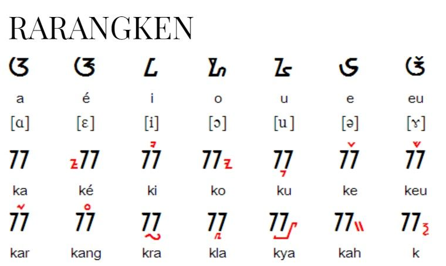

# Aksara Sunda OCR

## Overview

The **Aksara Sunda OCR** project is a convolutional neural network (CNN) based optical character recognition (OCR) system designed to recognize Aksara Sunda Rarangken characters.

The model is trained using TensorFlow to identify various Sundanese characters, leveraging data augmentation techniques and a robust CNN architecture.

## Features

- **Image Classification**: Capable of recognizing Aksara Sunda characters and their rarangken with high accuracy.
- **Data Augmentation**: Uses Keras' `ImageDataGenerator` for real-time data augmentation.
- **Deep Learning**: Implements a deep CNN architecture with multiple convolutional layers.
- **Customizability**: Easily modify the model architecture for experimenting with different configurations.

## Requirements

- Python 3.10
- TensorFlow 2.x
- Keras
- NumPy
- Matplotlib

